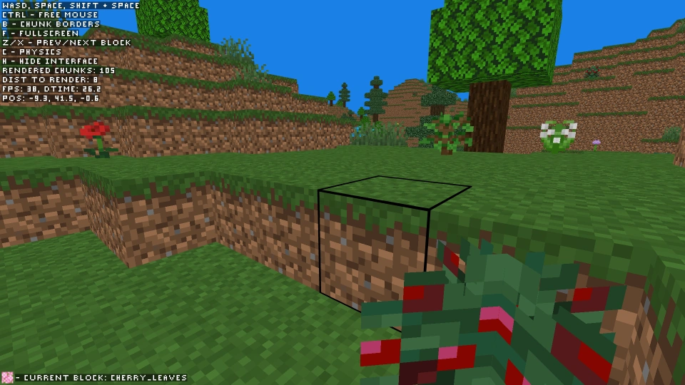
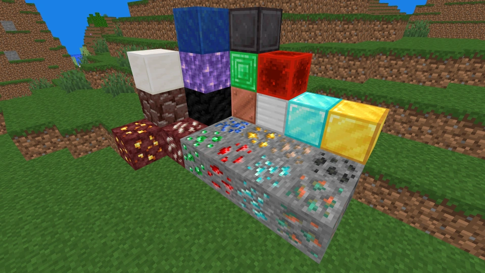
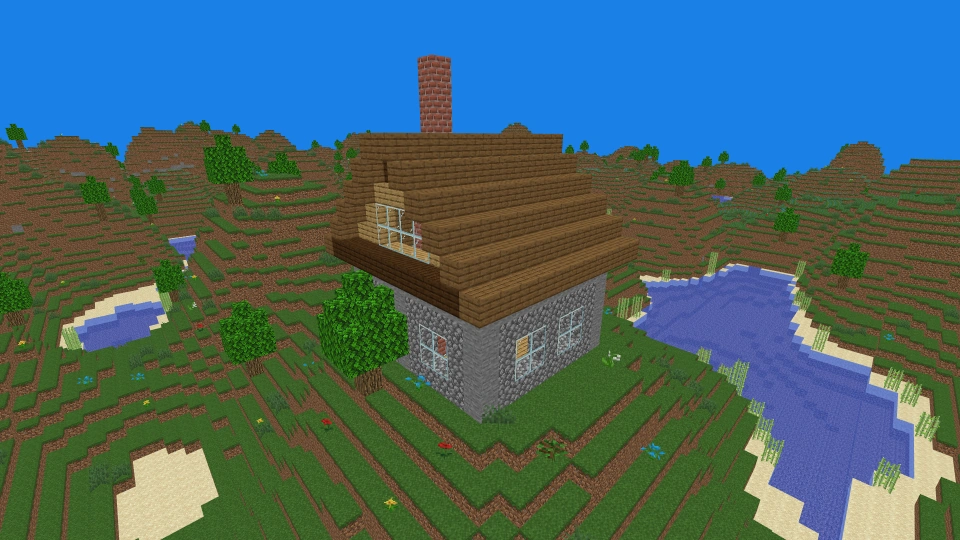

## Screenshots

***

## \[RU]

Простой клон Майнкрафта, созданный мной за месяц во время изучения современного OpenGL.  
Это ответ на вопрос "Зачем писать игру на чистом OpenGL, без всяких движков, упрощающих работу?"

Игра (если это можно так назвать) запускается менее чем за секунду такой командой:  
`python3 src/main.py`

Проект написан на Python и использует:
* `PyOpenGL` - включая его вспомогательную библиотеку `glut`;
* `glm` для математических операций с матрицами и векторами;
* `PIL` - только для чтения пары PNG-картинок.

Как и в обычном Майнкрафте, мир делится на чанки, но у меня сами чанки, в свою очередь, делятся на "колонки",
которые хранят в себе не элементы поштучно, а серии из подряд идущих элементов.  
Т. е. "200 воздуха" записываются как `[0, 200]`, а не как 200 нулей.

Это позволяет быстро делать следующие вещи:
* генерировать ландшафт чанка;
* записывать его на диск и читать обратно;
* генерировать для него отображаемую модель (буферы вершин и UV-координат).

Также это значит, что высота чанков не ограничена каким-то небольшим числом вроде 128 или 256.  
Чисто в теории, можно поставить в `config.py` хоть 1000, хоть 10000 - и всё будет работать.  
Ну а размер чанка на диске может запросто быть меньше 1 КБ.

Перед рендером чанка происходит проверка, видна ли хоть 1 из его заранее заданных ключевых точек.  
Если нет, то чанк не отправляется на отрисовку, что сильно экономит время рендера.  
Сама проверка занимает около 1 мс, но снижает кол-во отрисовываемых чанков примерно в 3 раза.

Создание и чтение модели для рендера выполняются сначала для видимых чанков, а уже потом - для чанков вне камеры.  
Благодаря этому мир визуально грузится быстрее.  
Кстати, реализованы плавные показ и удаление чанков, что тоже хорошо выглядит.  
Но, к сожалению, без тумана.  
И разумеется, игра не делает остановки при появлении новых чанков, а загружает их постепенно,
стараясь не сильно снижать частоту кадров.

Вообще, модели чанков кэшируются в `world/cached_chunk_models/`,
так что если их удалить - они будут просто созданы заново, когда это понадобится.  
При приёме/передаче мира на другой компьютер лучше удалить эту папку,
т. к. её файлы записаны с помощью `pickle`, а это небезопасно.  
Другие же данные записываются с помощью `json`, что безопасно, но несколько медленнее.

Объекты регистрируются с помощью самописного ассемблеро-подобного языка - внезапно это оказалось
сильно компактнее и удобнее, чем задавать все необходимые параметры на питоне.  
Код, интерпретирующий файлы `objects/*.txt`, занимает около 50 непустых строк, что совсем мало.

На данный момент поддерживаются только 3 вида блоков:
* Полные блоки (земля, камень, обсидиан, прозрачное стекло и т. д.);
* Диагональные блоки (паутина, тростник, гриб, саженец, трава, цветок и т. д.);
* Вода - ОЧЕНЬ базовая поддержка (по сути - только отображение верхней грани снаружи и изнутри).

Также есть:
* Простой генератор ландшафта;
* 162 зарегистрированных объекта;
* Возможность отдельно указать текстуру любой стороны для полного блока;
* Затенение боковых сторон и более сильное затенение нижней стороны (это важнее, чем может показаться на первый взгляд);
* Простая физика игрока (включая прыжок и удар о верхний блок);
* Режим полёта (в том числе сквозь препятствия);
* Возможность удалять (ЛКМ) и ставить (ПКМ) блоки, а также "получать" их
кликом средней кнопки мыши - всё как в оригинальном Майнкрафте;
* Отрисовка границ выделенного блока;
* Отключаемая отрисовка границ текущего чанка;
* Переключаемый полноэкранный режим;
* Вывод интерфейса: текст и 2D-картинки.

Что отсутствует:
* Все остальные модели, кроме полных и диагональных блоков: мобы, двери, ступеньки, факелы, торт и т. д.;
* Ctrl для ускорения и Shift для "осторожного" передвижения;
* Скайбокс (Солнце, Луна и звёзды) и время суток;
* Система освещения;
* Интерфейс инвентаря, верстака, печки и т. д.;
* Поворот блока при размещении;
* Блоки с полупрозрачными пикселями: цветное стекло, обычный лёд;
* Рост растений;
* Падение песка и гравия;
* Отображение "выпавших" предметов после разрушения их блоков;
* Медленное разрушение блоков;
* И многое, многое другое...

Текстуры объектов взяты с minecraft.wiki, а изображение с символами - самоделка.

***

## \[EN]
A simple Minecraft clone I created in a month while learning modern OpenGL.  
This is the answer to the question "Why write a game in pure OpenGL, without any engines to simplify the work?"

The game (if you can call it that) starts in less than a second with the following command:  
`python3 src/main.py`

The project is written in Python and uses:
* `PyOpenGL` - including its helper library `glut`;
* `glm` for mathematical operations with matrices and vectors;
* `PIL` - just for reading a couple of PNG images.

As in regular Minecraft, the world is divided into chunks, but in my case the chunks themselves, in turn,
are divided into "columns", which do not store elements individually, but a series of consecutive elements.  
That is, "200 air" is written as `[0, 200]`, and not as 200 zeros.

This allows us to quickly do the following things:
* generate chunk landscape;
* write it to disk and read it back;
* generate a display model for it (vertex and UV coordinate buffers).

This also means that the height of the chunks is not limited to some small number like 128 or 256.  
Purely in theory, you can put at least 1000, at least 10000 in `config.py` - and everything will work.  
Well, the size of a chunk on disk can easily be less than 1 KB.

Before rendering a chunk, a check is made to see if at least 1 of its predefined key points is visible.  
If not, then the chunk is not sent for rendering, which greatly saves rendering time.  
The check itself takes about 1 ms, but reduces the number of rendered chunks by about 3 times.

Creating and reading a model for rendering is performed first for visible chunks,
and only then for chunks outside the camera.  
Thanks to this, the world visually loads faster.  
By the way, smooth display and removal of chunks has been implemented, which also looks good.  
But, unfortunately, no fog.  
And of course, the game does not stop when new chunks appear, but loads them gradually,
trying not to significantly reduce the frame rate.

In general, chunk models are cached in `world/cached_chunk_models/`,
so if you delete them, they will simply be recreated when needed.  
When receiving/transferring the world to another computer, it is better to delete this folder,
because its files are written using `pickle`, and this is unsafe.  
Other data is written using `json`, which is safe, but somewhat slower.

Objects are registered using a self-written assembly-like language - suddenly
this turned out to be much more compact and convenient than setting all the necessary parameters in Python.  
The code that interprets `objects/*.txt` files takes about 50 non-empty lines, which is quite small.

Currently only 3 types of blocks are supported:
* Full blocks (dirt, stone, obsidian, clear glass, etc.);
* Diagonal blocks (cobweb, cane, mushroom, sapling, short grass, flower, etc.);
* Water - VERY basic support (essentially just displaying the top edge from the outside and inside).

There is also:
* Simple landscape generator;
* 162 registered objects;
* Ability to separately specify the texture of any side for a complete block;
* Shading the sides and more shading the bottom (this is more important than it may seem at first glance);
* Simple player physics (including jumping and hitting the top block);
* Flight mode (including through obstacles);
* The ability to remove (LMB) and place (RMB) blocks, as well as "receive" them by
clicking the middle mouse button - everything is like in the original Minecraft;
* Drawing the boundaries of the selected block;
* Switchable drawing of current chunk boundaries;
* Switchable full screen mode;
* Interface output: text and 2D pictures.

What's missing:
* All other models except full and diagonal blocks: mobs, doors, steps, torches, cake, etc.;
* Ctrl for acceleration and Shift for "careful" movement;
* Skybox (Sun, Moon and stars) and time of day;
* Lighting system;
* Interface of inventory, crafting table, furnace, etc.;
* Rotate a block when placed;
* Blocks with semitransparent pixels: colored glass, regular ice;
* Plant growth;
* Falling sand and gravel;
* Display of "dropped" items after the destruction of their blocks;
* Slow block destruction;
* And much, much more...

Object textures are taken from minecraft.wiki, and the image with symbols is self-made.
